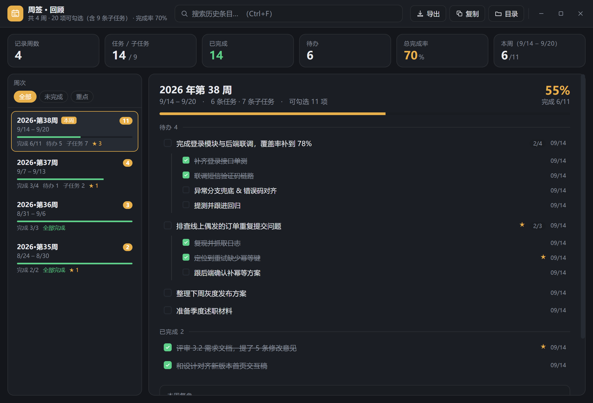
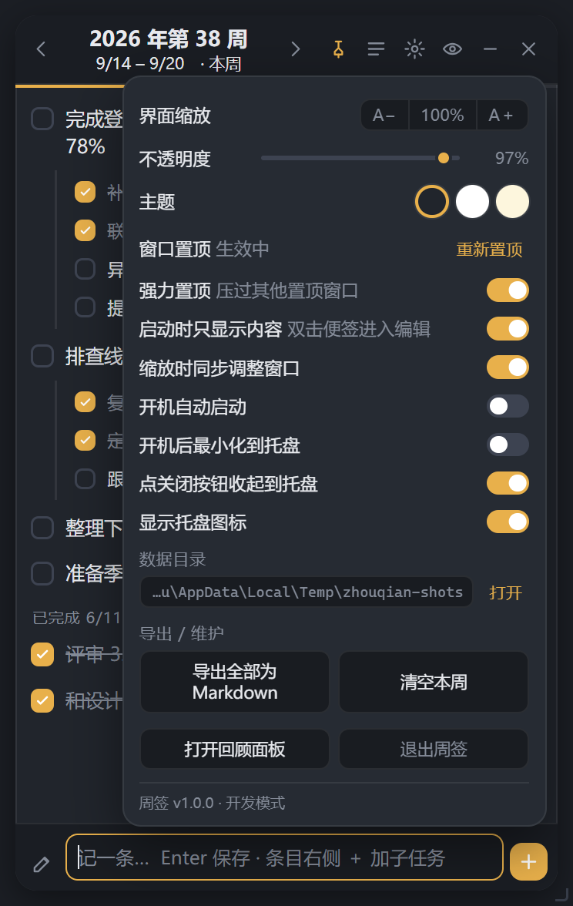

# 周笺 · Zhōujiān

[](https://github.com/caesargattuso/zhoujian/releases/latest)
[](#下载安装普通用户)
[](LICENSE)
[](https://www.electronjs.org/)

> 一张贴在 Windows 桌面上的周记便签。默认只有内容，双击才编辑。

「笺」是信笺、便笺的笺 —— 比"签"多一点纸的味道。**周笺**读起来又像「周间」，正是"一周之间"的意思。

- 🖥 **桌面贴纸形态**：默认只有内容，没有标题栏和按钮，窗口高度自动贴合文字
- ✍️ **双击即编辑**：双击展开完整界面，`Esc` 收回
- 📌 **强力置顶**：能压过其他置顶窗口，失焦后自动抢回最上层
- 📅 **按 ISO 周归档**：每周一份纯 JSON，人在记事本里也能看
- 🌲 **子任务**：父任务挂子任务，完成度自动汇总
- 🔍 **回顾面板**：跨周全文检索、统计、一键导出 Markdown
- 💾 **改动即存盘**：原子写入 + 覆盖前自动快照，不怕崩


---

## 下载安装（普通用户）

不想碰命令行就直接下打包好的版本：

👉 **[下载最新版 Release](https://github.com/caesargattuso/zhoujian/releases/latest)**

| 下载 | 适合 | 说明 |
| --- | --- | --- |
| `ZhouJian-<版本>-portable.exe` | 大部分人 | **单文件，双击即用**，无需安装。首次启动会先解压到临时目录，约 2–3 秒 |
| `ZhouJian-<版本>-win-x64.zip` | 想常驻用 | 解压到固定目录（别放临时目录），双击里面的 `ZhouJian.exe`。启动更快，数据就存在该目录 |

两种都不需要装 Node 或任何运行库，Electron 运行时已打包在内。

> 文件用英文名是因为 GitHub 会剥掉 Release 文件名里的中文字符，中文名称请以上表为准。
> 未做代码签名，首次运行 SmartScreen 可能提示「未知发布者」，点「更多信息 → 仍要运行」即可。

---

## 从源码运行

| 方式 | 操作 |
| --- | --- |
| 无黑框启动（推荐） | 双击 `启动周笺.vbs` |
| 带日志启动 | 双击 `start.bat` |
| 命令行 | `npm start` |
| 打包成独立 exe | `npm run dist`（产物在 `release/`） |

首次运行前如果没装过依赖，先执行一次：

```bash
npm install
```

> 依赖只装一次。装完后 `node_modules/electron/dist/electron.exe` 就是运行时，整套东西可以直接拷到别的电脑用。

---

## 界面

**① 桌面贴纸形态（默认）** —— 只有内容


**② 双击展开编辑** —— 标题栏、加子任务、勾选、⭐、输入框、设置全部回来


**③ 回顾面板** —— 跨周统计 / 检索 / 明细



**④ 设置**



---

## 编辑形态的布局

```
┌──────────────────────────────────────┐
│ ‹   2026 年第 38 周   ›     📌 ☰ ⚙ ─ ✕│  ← 按住这里拖动窗口
│         9/14 – 9/20 · 本周            │
├──────────────────────────────────────┤  ← 进度条（本周完成率）
│ ☐ 完成登录模块联调              ★ 🗑  │  ← 双击文字改内容，拖动换顺序
│ ☐ 评审需求文档                        │
│ ──── 已完成 1/3 ────                  │
│ ☑ 周会纪要                            │
├──────────────────────────────────────┤
│ ✎  记一笔… Enter 保存 · Shift+Enter 换行  ＋│
└──────────────────────────────────────┘
```

---

## 功能对照

### 贴在桌面最前端
- 窗口默认 `alwaysOnTop`，始终浮在其他窗口之上。
- 点标题栏的 📌 可随时切换置顶。
- 无边框 + 圆角 + 半透明，可拖动、可八向缩放（拖边框/四角）。
- 按 `✕` 是**收起到托盘**而不是退出，托盘图标点一下就能叫回来。想真正退出用托盘右键 → 退出周笺。

### 按周记录
- 每一 ISO 周（周一到周日）独立归档，标题自动显示「2026 年第 38 周」。
- `Alt + ←` / `Alt + →` 翻周，`Alt + T` 跳回本周；点标题也能回本周。
- 条目支持：勾选完成、⭐ 标重点、双击改文字、拖拽排序、删除、**挂子任务**（见下一节）。
- 底部 🌟 图标可展开「本周复盘」写总结，同样自动保存。

### 桌面贴纸形态（默认）↔ 编辑形态

**默认状态下，桌面上就只有一张"纸"** —— 只有内容，没有标题栏、输入框、按钮：

```
┌────────────────────────────────────────┐
│ 第 38 周  9/14 – 9/20 · 本周      6/11 │  ← 拖动条 + 周次/进度
├────────────────────────────────────────┤  ← 进度发丝线
│  完成登录模块与后端联调，覆盖率…    2/4 │
│   │ 补齐登录接口单测                    │
│   │ 联调短信验证码链路                  │
│  排查线上偶发的订单重复提交问题      2/3 │
│   │ 定位到重试缺少幂等键                │
│  整理下周灰度发布方案                   │
│  ─── 已完成 6/11 ───                   │
│  评审 3.2 需求文档，提了 5 条修改意见   │
└────────────────────────────────────────┘
```

- **双击便签任意位置 → 展开成完整编辑界面**（标题栏、＋加子任务、勾选框、⭐、输入框、设置面板全部回来）
- 编辑完按 **`Esc`**，或点标题栏的 **👁** 按钮 → 收回贴纸形态
- 收回时**窗口高度自动贴合内容**（量一遍真实内容高度再设窗口，装不下才滚动），像张真便签；展开时还原成之前记住的编辑高度
- 右下角悬停会出现淡淡的「双击编辑」提示，不吵
- 只读态**保留**：拖动（拖表头）、八向缩放、滚轮滚动、子任务的 `2/4` 进度徽标
- 托盘菜单也有「展开编辑 / 收起为只读」

想关掉这个行为（一打开就是编辑界面），把设置里的「启动时只显示内容」取消勾选即可。

> 为什么只读态还要留表头？它既是拖动条，也用来显示周次和完成进度 ——
> 不然一张纸上完全看不出这是哪一周。

### 子任务（父任务下面挂子任务）
一条记录可以往下挂**一层**子任务（便签宽度有限，再深就没法看了）。

- **加子任务**：把鼠标移到条目上，点右侧的 **＋**，下面会弹出输入行；`Enter` 连按可以**连续录入**，`Esc` 收起。
- **完成状态联动**：父任务的 `done` 是**派生值** —— 子任务没全做完，父任务就不算完成；全部做完父任务自动变完成。
  点父任务的勾选框等于**全选 / 全不选**它下面的所有子任务，不会出现"父勾了子没做完"的矛盾状态。
- **进度**：父任务右侧显示 `2/4` 这样的子任务进度；全部完成时高亮。
- **增删改**：子任务同样支持勾选、双击改文字、⭐ 标重点、删除。
- **层级调整**：
  - 子任务上的 **↑** = 升级成独立条目（排到原父任务后面）
  - 条目上的 **↓** = 降为上一个条目的子任务
  - 也可以直接拖拽：拖到别的条目上换位，拖到某个条目的子任务区就变成它的子任务
- **统计口径**：进度条、周列表、回顾面板的完成率一律按**可勾选单元**算 ——
  有子任务的父任务只算它的子任务，不重复计数。例：2 条任务共 3 个子任务 = 可勾选 3 项。
- 回顾窗口里父子层级同样展示，搜索子任务会带出它属于哪条父任务；导出 Markdown 也是标准嵌套列表。

### 开机自启
- 设置面板（⚙）里打开「开机自动启动」，写入注册表
  `HKCU\Software\Microsoft\Windows\CurrentVersion\Run`，不弹 UAC。
- 可配合「开机后最小化到托盘」，实现开机静默待命。
- 便携版会正确指向你自己的 exe 路径（不是解压出来的临时目录）。

### 布局缩放
- 面板里 `A− / A＋`，或快捷键 `Ctrl + =` / `Ctrl + -` / `Ctrl + 0`（100%）。
- 缩放范围 70% – 200%。
- 打开「缩放时同步调整窗口」后，字号和窗口一起等比放大，排版比例不变；关掉则只放大内容。
- 手动拖边缩放后，系统会记住新的基准尺寸，之后再按比例缩放以此为基准。
- 还有独立的「不透明度」滑杆，做成便签的纸感。

### 存盘
- **每一条改动都会写盘**，400ms 防抖，切周/失焦/隐藏窗口时立即落盘，不存在「忘了保存」。
- 写入是 **先写临时文件 → fsync → 原子重命名**，断电或崩溃不会写出半个坏文件。
- 每次覆盖前自动留一份快照，每周保留最近 8 份，放在 `data/weeks/.backup/`。
- 数据是纯 JSON，可以直接用记事本打开、改、用 Git 管。

### 回顾（Review）
点 ☰ 或按 `Ctrl + R` 打开独立回顾窗口：

- **统计条**：记录周数、累计条目、已完成、待办、总完成率、本周进度。
- **周次侧栏**：倒序列出所有周，带完成进度条和待办数；筛选器可切「全部 / 未完成 / 重点」。
- **明细区**：勾选状态可直接点改，复盘也能直接编辑，改完立刻回写到便签窗口。
- **全文检索**：跨所有周搜索条目正文和周复盘，命中处高亮，点标题直接跳到那一周。
- **导出 / 复制**：一键导出全部为 Markdown（含 `- [x]` 复选框语法），或直接复制到剪贴板。

---

## 快捷键

| 快捷键 | 作用 |
| --- | --- |
| `Enter` | 保存当前输入 |
| `Shift + Enter` | 输入框内换行 |
| `Alt + ← / →` | 上一周 / 下一周 |
| `Alt + T` | 回到本周 |
| `Ctrl + =` / `-` / `0` | 放大 / 缩小 / 复位 |
| `Ctrl + R` | 打开回顾面板 |
| `Ctrl + L` | 定位到输入框（若在只读态会先展开） |
| `Esc` | 关面板 → 退出行内编辑 → 收回只读贴纸形态 |
| `Ctrl + F` | （回顾窗口）聚焦搜索 |
| `↑ / ↓` | （回顾窗口）切换周 |
| `Esc` | 关面板 / 退出编辑 |
| 双击条目 | 编辑文字 |
| 拖动条目 | 调整顺序 |

---

## 数据在哪

默认在项目目录下的 `data/`（便携版则在与 exe 同级的 `data/`；若该目录不可写会自动回落到 `%APPDATA%/周笺/data`）。

```
data/
├─ settings.json          置顶、透明度、缩放、主题、自启、窗口位置…
├─ weeks/
│  ├─ 2026-W38.json       本周内容（人类可读）
│  ├─ 2026-W37.json
│  └─ .backup/            每次覆盖前的快照
└─ export/
   └─ 工作周记-2026-09-14.md
```

单周文件长这样（`children` 是子任务，没有子任务时是空数组；老文件缺这个字段也能正常读）：

```json
{
  "week": "2026-W38",
  "title": "2026 年第 38 周",
  "range": "9/14 – 9/20",
  "summary": "本周复盘文字…",
  "entries": [
    {
      "id": "m1a2b3c",
      "text": "完成登录模块联调",
      "done": false,
      "star": false,
      "children": [
        {
          "id": "c9x8y7",
          "text": "补齐登录接口单测",
          "done": true,
          "star": false,
          "createdAt": "2026-09-14T02:11:00.000Z",
          "updatedAt": "2026-09-14T05:40:00.000Z"
        },
        {
          "id": "c1z2w3",
          "text": "提测并跟进回归",
          "done": false,
          "star": false,
          "createdAt": "2026-09-14T02:11:00.000Z",
          "updatedAt": "2026-09-14T02:11:00.000Z"
        }
      ],
      "createdAt": "2026-09-14T02:11:00.000Z",
      "updatedAt": "2026-09-14T05:40:00.000Z"
    }
  ]
}
```

> 父任务的 `done` 由子任务推导，手改也没用 —— 每次存盘都会按「子任务是否全部完成」重算，保证数据不会自相矛盾。

想换数据位置，启动前设环境变量 `ZHOUJIAN_DATA_DIR`。

---

## 打包

```bash
npm run dist                        # 输出到 release/
node tools/build.js --out=dist-out  # 指定输出目录
node tools/build.js --no-kill       # 不动正在运行的实例
```

产物：`<输出目录>/周笺-<版本>-便携版.exe`（单文件，双击即用，配置和数据存在 `data/`）。

`tools/build.js` 处理了三件在国内网络 + 非管理员 Windows 上必踩的事：

1. **二进制走国内镜像** —— electron 与 electron-builder 的附属二进制默认从 GitHub 拉，直连很慢，脚本里换成 npmmirror
2. **winCodeSign 解压失败** —— 该包 `darwin/` 下有 `.dylib` 符号链接，非管理员账户建不了 symlink，7za 返回非零码会让整个构建中止。脚本会预先解压好缓存（排除 darwin）供其复用
3. **文件被锁** —— 若 `ZhouJian.exe` 正在运行，`win-unpacked` 里的文件会被占用，构建报 `The process cannot access the file`。脚本会先结束残留实例

想要「解压即用」的绿色版，把 `win-unpacked/` 整个目录压缩即可（启动比单文件便携版快，省掉每次解压到临时目录的 2–3 秒）。

---

## 自检

```bash
npm run selftest    # 55 项冒烟检查，全过退出码 0
npm run shots       # 灌入示例数据，把 9 个界面状态截图到 shots/
npm run diag        # 输出当前环境诊断（置顶状态、启动项、数据目录），写 diag-report.json
```

`npm run selftest` 覆盖：ISO 周计算与跨年、存盘往返、原子写入无残留、覆盖前备份、统计口径、跨周检索、Markdown 导出、配置持久化、窗口创建、**渲染层无脚本错误**、程序化缩放、界面骨架完整、八向手柄、preload 桥可用、脚本已执行、只读贴纸态的实际 computed style、**置顶 4 项硬性断言**、**子任务 13 项**（派生状态 / 叶子计数 / 检索带父任务 / Markdown 嵌套 / 老格式兼容）、开机自启写入读回与清理、图标、托盘。

> 唯一的软性项是「开机自启注册表直查校验」：当 `reg.exe` 被执行策略拦住时无法校验，报告里会标为软性失败，不计入硬性通过条件。

---

## 已知取舍与排查

**启动脚本的编码要求（改脚本前必读）**
Windows 对这两个文件的行尾与编码有硬要求，改坏了就会报错：

| 文件 | 编码 | 行尾 | 为什么 |
| --- | --- | --- | --- |
| `start.bat` | **纯 ASCII**，不能有中文 | **CRLF** | cmd.exe 按控制台代码页解码 .bat，非 ASCII 字节会把一行拆成两条命令（出现 `'m' 不是内部或外部命令` 这类怪错）；LF 行尾会让 `goto` 标签失效 |
| `启动周笺.vbs` | **UTF-16LE + BOM**（`FF FE` 开头） | CRLF | Windows Script Host 默认按 ANSI(GBK) 读 .vbs。UTF-8 无 BOM 的中文会被误解码，直接报 `Microsoft VBScript 编译器错误: 未结束的字符串常量` |

用编辑器另存时注意别把它存回 UTF-8。命令行核验：

```bat
findstr /C:"周笺" 启动周笺.vbs
```

**置顶的实现细节（排查时看这里）**
在 Windows 上做了对照实验，结论和直觉不一样：

1. **不带 level 的 `setAlwaysOnTop(true)` 在本机完全不生效** —— 调用不报错，但
   `isAlwaysOnTop()` 仍返回 `false`，桌面截图也确认窗口确实没在最上层。
   `setAlwaysOnTop(true,'floating')`、先 `false` 再 `true`、只靠构造参数
   `alwaysOnTop: true`，**统统无效**。
2. **只有更高层级的 `setAlwaysOnTop(true, '<level>')` 才真正生效。**
   本机实测可用的有 `pop-up-menu` 和 `screen-saver`。
3. 程序启动时会把候选层级挨个试一遍，记住哪些真的能生效，然后：
   - **强力置顶（默认开）** → 用最强的那一档，能压过其他置顶窗口
   - 关掉 → 用最弱的那一档，只保证浮在普通窗口之上
4. **同级置顶窗口之间仍然是"谁最后激活谁在上"**，所以还要定期重申：
   每 1.5 秒检查一次，每 3 秒强制重打一次并 `moveTop()`，失焦时连打 4 次。
   实测：对手无论用低档还是同档置顶把便签压住，重申都能把最上层抢回来。

排查入口：

- 标题栏 📌 悬停会显示当前置顶层级；配置说要置顶但系统实际没置顶时图钉变**红色告警态**，点一下即重新置顶；
- 设置面板有「窗口置顶 生效中/未生效」「强力置顶」开关和「重新置顶」按钮；
- 托盘菜单有「立即重新置顶」；
- `npm run diag` 会输出探测到的可用层级和最后一次置顶动作的结果。

自检里有 5 项硬性断言覆盖这条链路，`npm run selftest` 会一起跑。

**圆角与半透明**
窗口用透明背景实现圆角和投影。个别关闭了桌面合成（DWM）的环境圆角会退化成直角，此时用 `--no-transparency` 启动即可。也可在设置面板里关掉（`transparency`）。

**开机自启**
走 Electron 原生 `setLoginItemSettings` 写 `HKCU\...\Run`，不需要管理员权限、不弹 UAC。校验优先直查注册表，若 `reg.exe` 被安全软件拦截则自动回落到 Electron 读回，并在设置面板提示失败原因。便携版会用 `PORTABLE_EXECUTABLE_FILE` 指向你自己的 exe，而不是解压出来的临时目录。

**便携版启动速度**
每次启动会解压到临时目录，首次约 2–3 秒，属正常现象。想要秒开就用源码方式 + `启动周笺.vbs`。

**开发模式下开机会启动什么**
未打包时会写入 `"<electron.exe>" "<项目目录>" --autostart`，依赖 `node_modules` 存在。打包后自动切换成 exe 自身路径。

---

## 目录结构

```
todo-list/
├─ main.js              主进程：窗口 / 托盘 / 置顶守护 / 自启 / IPC
├─ preload.js           安全桥（contextIsolation，不暴露 node）
├─ src/
│  ├─ week.js           ISO-8601 周计算
│  ├─ store.js          存盘、备份、检索、导出
│  ├─ selftest.js       冒烟自检（--selftest）
│  └─ shots.js          界面截图（--shots）
├─ renderer/
│  ├─ index.html/css/js 便签窗口
│  └─ review.html/css/js 回顾窗口
├─ tools/make_icon.py   图标生成（纯标准库，无第三方依赖）
├─ assets/              icon.png / icon.ico / tray.png
├─ data/                数据目录（初始为空）
├─ shots/               界面截图产物
├─ start.bat / 启动周笺.vbs
└─ package.json
```
